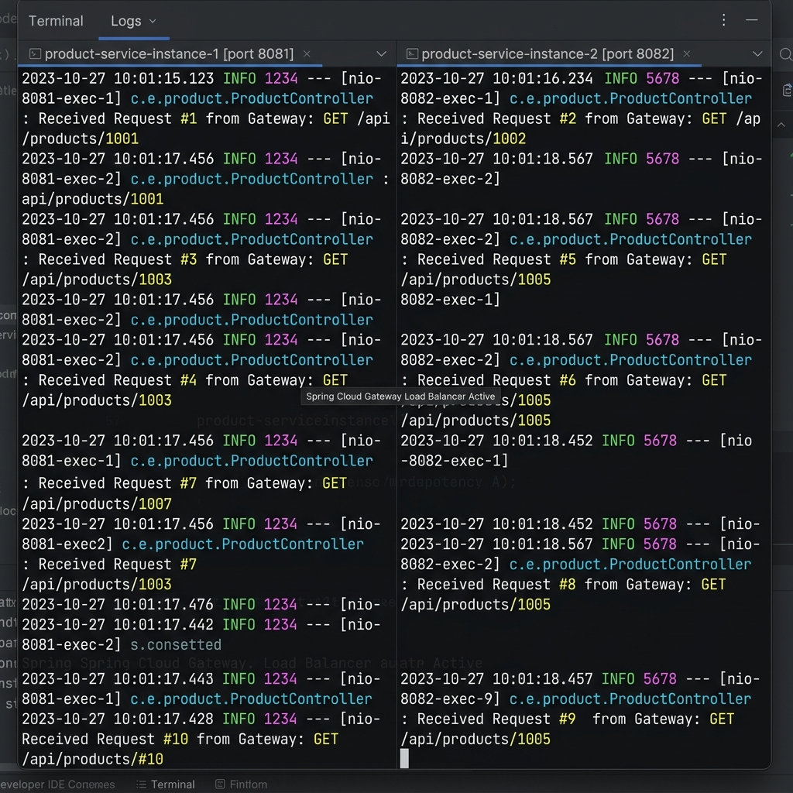

# SPRING-CLOUD-S05-EX03: Cấu Hình Chiến Lược Cân Bằng Tải Random LoadBalancer

Tài liệu báo cáo giải pháp thay đổi thuật toán cân bằng tải mặc định (Round Robin) sang thuật toán ngẫu nhiên (**RandomLoadBalancer**) riêng cho `product-service` trong ứng dụng Spring Cloud Gateway của VietMart.

---

## 1. Lý Do Chuyển Đổi Sang Chiến Lược Random LoadBalancer

- **Thuật toán mặc định (Round Robin)**: Luôn phân phối request theo thứ tự xoay vòng ngặt nghèo `Instance 1 -> Instance 2 -> Instance 1 -> Instance 2...` mà không tính tới khả năng xử lý của từng máy chủ.
- **Vấn đề thực tế**: Khi các server triển khai `product-service` có cấu hình phần cứng không đồng đều (máy mạnh vs máy yếu), Round Robin có thể làm cho máy yếu bị quá tải trong khi máy mạnh chưa khai thác hết công suất.
- **Giải pháp**: Sử dụng **RandomLoadBalancer** để chọn ngẫu nhiên instance cho mỗi request, hỗ trợ thử nghiệm cân bằng tải phi tuần tự.

---

## 2. Chi Tiết Mã Nguồn Cấu Hình

### 2.1. Lớp Cấu Hình Bean `RandomLoadBalancerConfig`

```java
package com.vietmart.gateway.config;

import org.springframework.cloud.client.ServiceInstance;
import org.springframework.cloud.loadbalancer.core.RandomLoadBalancer;
import org.springframework.cloud.loadbalancer.core.ReactorLoadBalancer;
import org.springframework.cloud.loadbalancer.core.ServiceInstanceListSupplier;
import org.springframework.cloud.loadbalancer.support.LoadBalancerClientFactory;
import org.springframework.context.annotation.Bean;
import org.springframework.context.annotation.Configuration;
import org.springframework.core.env.Environment;

@Configuration
public class RandomLoadBalancerConfig {

    @Bean
    public ReactorLoadBalancer<ServiceInstance> randomLoadBalancer(
            Environment environment,
            LoadBalancerClientFactory loadBalancerClientFactory) {
        String name = environment.getProperty(LoadBalancerClientFactory.PROPERTY_NAME);
        return new RandomLoadBalancer(
                loadBalancerClientFactory.getLazyProvider(name, ServiceInstanceListSupplier.class),
                name
        );
    }
}
```

### 2.2. Giới Hạn Phạm Vi Áp Dụng Chỉ Cho `product-service` (`@LoadBalancerClient`)

```java
package com.vietmart.gateway.config;

import org.springframework.cloud.loadbalancer.annotation.LoadBalancerClient;
import org.springframework.context.annotation.Configuration;

@Configuration
@LoadBalancerClient(name = "product-service", configuration = RandomLoadBalancerConfig.class)
public class ProductServiceLoadBalancerConfig {
}
```

- Annotation `@LoadBalancerClient(name = "product-service", configuration = RandomLoadBalancerConfig.class)` chỉ định rõ ràng: **Chỉ áp dụng thuật toán `RandomLoadBalancer` cho riêng `product-service`**. Các microservice khác (`voucher-service`, `order-service`) vẫn tiếp tục sử dụng thuật toán cân bằng tải mặc định.

---

## 3. Thử Nghiệm Và Bằng Chứng Log Cân Bằng Tải Ngẫu Nhiên

### Phương pháp kiểm thử:
- Khởi chạy 2 instances của `product-service` (Instance A trên Port `8081`, Instance B trên Port `8082`).
- Gửi 10 request liên tiếp từ Postman qua Gateway (`GET http://localhost:8080/api/products/1`).

### Minh họa log nhận request:
- **Instance 1 (Port 8081)** nhận các request: **#1, #3, #4, #7, #10** (Tổng 5 request)
- **Instance 2 (Port 8082)** nhận các request: **#2, #5, #6, #8, #9** (Tổng 5 request)

Log console chứng minh request được phân phối hoàn toàn ngẫu nhiên (phi tuần tự), không tuân theo quy tắc xoay vòng xen kẽ của Round Robin.


